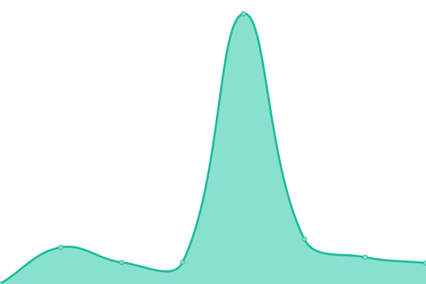
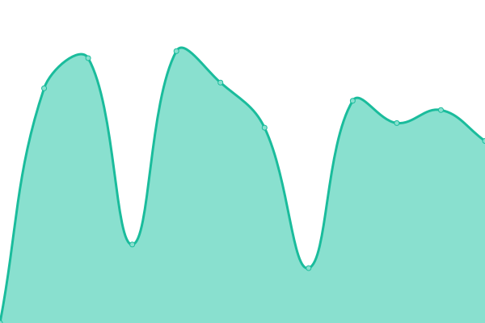
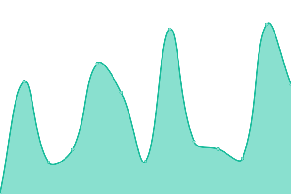
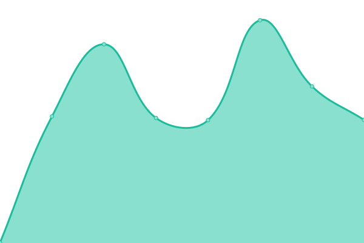

# [📈 Live Status](https://demo.upptime.js.org): <!--live status--> **🟩 All systems operational**

This repository contains the open-source uptime monitor and status page for [theselfhostingart](https://demo.upptime.js.org), powered by [Upptime](https://github.com/upptime/upptime).

With [Upptime](https://upptime.js.org), you can get your own unlimited and free uptime monitor and status page, powered entirely by a GitHub repository. We use [Issues](https://github.com/theselfhostingart/UptimeTheSelfHostingArt/issues) as incident reports, [Actions](https://github.com/theselfhostingart/UptimeTheSelfHostingArt/actions) as uptime monitors, and [Pages](https://demo.upptime.js.org) for the status page.

<!--start: status pages-->
<!-- This summary is generated by Upptime (https://github.com/upptime/upptime) -->
<!-- Do not edit this manually, your changes will be overwritten -->
<!-- prettier-ignore -->
| URL | Status | History | Response Time | Uptime |
| --- | ------ | ------- | ------------- | ------ |
|  [TheSelfHostingArt Site](https://theselfhosting.art/) | 🟩 Up | [the-self-hosting-art-site.yml](https://github.com/theselfhostingart/UptimeTheSelfHostingArt/commits/HEAD/history/the-self-hosting-art-site.yml) | 

 909ms
     
 | 

<a href="https://uptime.theselfhosting.art/history/the-self-hosting-art-site">100.00%</a>
    

|  [Piped TheSelfHostingArt](https://piped.theselfhosting.art/) | 🟩 Up | [piped-the-self-hosting-art.yml](https://github.com/theselfhostingart/UptimeTheSelfHostingArt/commits/HEAD/history/piped-the-self-hosting-art.yml) | 

 1148ms
     
 | 

<a href="https://uptime.theselfhosting.art/history/piped-the-self-hosting-art">99.59%</a>
    

|  [Search TheSelfHostingArt](https://search.theselfhosting.art/) | 🟩 Up | [search-the-self-hosting-art.yml](https://github.com/theselfhostingart/UptimeTheSelfHostingArt/commits/HEAD/history/search-the-self-hosting-art.yml) | 

 1959ms
     
 | 

<a href="https://uptime.theselfhosting.art/history/search-the-self-hosting-art">99.62%</a>
    

|  [Paste TheSelfHostingArt](https://paste.theselfhosting.art/) | 🟩 Up | [paste-the-self-hosting-art.yml](https://github.com/theselfhostingart/UptimeTheSelfHostingArt/commits/HEAD/history/paste-the-self-hosting-art.yml) | 

 1239ms
     
 | 

<a href="https://uptime.theselfhosting.art/history/paste-the-self-hosting-art">99.74%</a>
    

|  [Bookmarks TheSelfHostingArt](https://bookmarks.theselfhosting.art) | 🟩 Up | [bookmarks-the-self-hosting-art.yml](https://github.com/theselfhostingart/UptimeTheSelfHostingArt/commits/HEAD/history/bookmarks-the-self-hosting-art.yml) | 

 1137ms
     
 | 

<a href="https://uptime.theselfhosting.art/history/bookmarks-the-self-hosting-art">99.68%</a>
    

|  [Send TheSelfHostingArt](https://send.theselfhosting.art/) | 🟩 Up | [send-the-self-hosting-art.yml](https://github.com/theselfhostingart/UptimeTheSelfHostingArt/commits/HEAD/history/send-the-self-hosting-art.yml) | 

 1752ms
     
 | 

<a href="https://uptime.theselfhosting.art/history/send-the-self-hosting-art">99.80%</a>
    

|  [Chat TheSelfHostingArt](https://chat.theselfhosting.art/) | 🟩 Up | [chat-the-self-hosting-art.yml](https://github.com/theselfhostingart/UptimeTheSelfHostingArt/commits/HEAD/history/chat-the-self-hosting-art.yml) | 

 527ms
     
 | 

<a href="https://uptime.theselfhosting.art/history/chat-the-self-hosting-art">100.00%</a>
    

<!--end: status pages-->

[**Visit our status website →**](https://demo.upptime.js.org)

## 📄 License

- Powered by: [Upptime](https://github.com/upptime/upptime)
- Code: [MIT](./LICENSE) © [Anand Chowdhary](https://anandchowdhary.com), supported by [Pabio](https://pabio.com)
- Data in the `./history` directory: [Open Database License](https://opendatacommons.org/licenses/odbl/1-0/)
